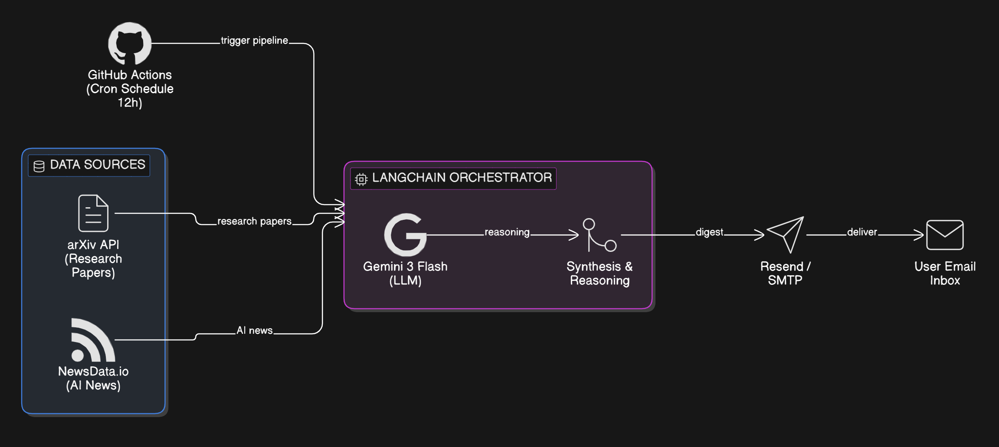

\# AI Research \& News Agent

\*\*Autonomous Research Aggregator built with LangChain and Google Gemini\*\*


\## Overview

This project is an automated research assistant designed to solve the problem of information overload in the Artificial Intelligence field. It programmatically monitors academic pre-print servers and tech news, processes the content using Large Language Models (LLMs), and delivers a structured digest to a specified email address.

<div align="center">
  
  <p><i>The System Architecture: Data flows from APIs through LangChain to a daily email digest.</i></p>
</div>


\## Technical Architecture

The system follows a modular pipeline:

1\. \*\*Data Retrieval:\*\* Utilizing `ArxivLoader` to fetch metadata and abstracts of the latest AI-related research.

2\. \*\*Orchestration:\*\* Implementing LangChain Expression Language (LCEL) to pipe document content into a reasoning engine.

3\. \*\*Processing:\*\* Summarization and synthesis performed by the Gemini 2.5 Flash model.

4\. \*\*Delivery:\*\* Formatted HTML output dispatched via the Resend API.

5\. \*\*Automation:\*\* Serverless execution managed through GitHub Actions on a cron-schedule.


\## Learning Outcomes

This was my primary project for learning the LangChain framework. Through development, I gained hands-on experience in:


\* \*\*LCEL (LangChain Expression Language):\*\* Moving beyond basic procedural scripts to a declarative approach using the `|` operator for better modularity.

\* \*\*Prompt Engineering:\*\* Designing system-level prompts that enforce specific HTML formatting and structural constraints on model output.

\* \*\*Environment Security:\*\* Managing sensitive API credentials using GitHub Secrets and `.gitignore` to prevent credential leakage in public repositories.

\* \*\*Dependency Management:\*\* Troubleshooting environment-specific issues with libraries like PyMuPDF (`fitz`) when processing document-heavy data.


\## Local Setup

To run this project locally, follow these steps:


1\. \*\*Clone the repository:\*\*

&nbsp;  ```bash

&nbsp;  git clone \[https://github.com/YOUR\_USERNAME/ai-research-agent.git](https://github.com/YOUR\_USERNAME/ai-research-agent.git)

&nbsp;  cd ai-research-agent


2\. \*\*Configure Environment Variables:\*\*

&nbsp;  GOOGLE\_API\_KEY=your\_key\_here

&nbsp;  RESEND\_API\_KEY=your\_key\_here


3\. \*\*Install Dependencies:\*\*

&nbsp;  python -m venv .venv

&nbsp;  # Windows

&nbsp;  .venv\\Scripts\\activate

&nbsp;  # Mac/Linux

&nbsp;  source .venv/bin/activate


&nbsp;  pip install -r requirements.txt


4\. \*\*Run the Script:\*\*

&nbsp;  python agent.py


\*\*Automation:\*\*

The agent is configured to run automatically every day at 08:00 UTC via the ".github/workflows/daily\_run.yml" configuration. Status reports can be viewed under the Actions tab.

graph LR
    A[Clock: GitHub Actions] --> B(Agent: Python/LangChain)
    B --> C{Sourcing}
    C --> D[arXiv API]
    C --> E[NewsData.io]
    D --> F[Gemini 3 Flash]
    E --> F
    F --> G[Summarization Engine]
    G --> H[Email: Resend/SMTP]
